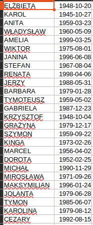
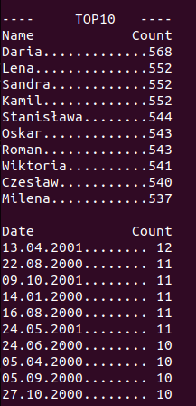

# Rozwiązanie: Wyświetlanie 10 najczęstszych imion i dat urodzenia z pliku CSV

Ten skrypt PHP ma na celu wyświetlenie listy 10 najczęściej występujących imion i dat urodzenia na podstawie danych dostarczonych w pliku CSV. 
Wyniki zostaną posortowane malejąco według liczby wystąpień. 
W przypadku wielu nazw lub dat o tej samej liczbie wystąpień, pierwsza napotkana zachowa swoją pozycję na liście.
# Input ------------------- Output
 

